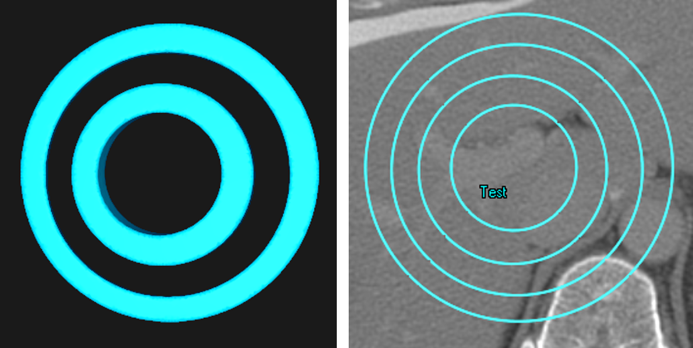

# We're published! Please check out the Technical Note here: https://www.sciencedirect.com/science/article/abs/pii/S1879850021000485 and reference this work if you find it useful
### DOI:https://doi.org/10.1016/j.prro.2021.02.003

## This code provides functionality for turning dicom images and RT structures into nifti files as well as turning prediction masks back into RT structures
## Installation guide
    pip install DicomRTTool
### Highly recommend to go through the jupyter notebook in the Examples folder and to read the Wiki

### Quick use guide
    from DicomRTTool.ReaderWriter import DicomReaderWriter, ROIAssociationClass
    Dicom_path = r'.some_path_to_dicom'
    Dicom_reader = DicomReaderWriter(description='Examples', arg_max=True)
    Dicom_reader.walk_through_folders(Dicom_path) # This will parse through all DICOM present in the folder and subfolders
    all_rois = Dicom_reader.return_rois(print_rois=True) # Return a list of all rois present
    
    Contour_names = ['tumor'] # Define what rois you want
    associations = [ROIAssociationClass('tumor', ['tumor_mr', 'tumor_ct'])] # Any list of roi associations
    Dicom_reader.set_contour_names_and_assocations(contour_names=Contour_names, associations=associations)
    
    Dicom_reader.get_images_and_mask()
    
    image_numpy = Dicom_reader.ArrayDicom
    mask_numpy = Dicom_reader.mask
    image_sitk_handle = Dicom_reader.dicom_handle
    mask_sitk_handle = Dicom_reader.annotation_handle

### Other interesting additions
### Adding information to the Dicom_reader.series_instances_dictionary
    from DicomRTTool.ReaderWriter import Tag
    plan_pydicom_string_keys = {"MyNamedRTPlan": Tag((0x300a, 0x002))}
    image_sitk_string_keys = {"MyPatientName": "0010|0010"}
    Dicom_reader = DicomReaderWriter(description='Examples', arg_max=True, plan_pydicom_string_keys=plan_pydicom_string_keys, image_sitk_string_keys=image_sitk_string_keys)
    

##### If you find this code useful, please provide a reference to my github page for others www.github.com/brianmanderson , thank you!

###### Ring update allows for multiple rings to be represented correctly

#### Works on oblique images for masks and predictions*
